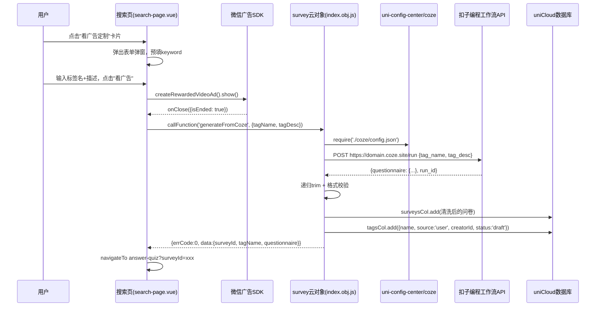

## 产品概述

在搜索页已有的"看广告定制"弹窗（已开发好 UI 骨架，`submitCustomTag` 方法目前是 toast 占位）基础上，接入扣子编程新版工作流 API，实现用户搜索不到想要的标签时，通过看激励视频广告实时生成问卷的完整流程。

## 核心功能

1. **Coze API 接入**：survey 云对象新增 `generateFromCoze` 方法，调已部署工作流 API，传入 `tag_name` / `tag_desc`，接收问卷 JSON
2. **数据清洗与校验**：全字段递归 trim（防 Coze 空格 bug，实测有带前导空格的维度名如 `" 脾气爆冲型"`），执行格式校验
3. **自动入库**：校验通过后插入 `surveys` 表，创建 `survey-tags` 记录（`source: 'user'`、`creatorId`、`status: 'draft'`）
4. **前端广告流程**：用户填标签名 + 描述 → 播激励视频广告 → 调云函数 → 生成成功跳答题页
5. **Token 安全存储**：通过 `uni-config-center/coze/config.json` 配置，不暴露在前端

## 技术栈

- **后端**: uniCloud 云对象 (.obj.js) + `uniID.uni-id-common`
- **HTTP 请求**: `uniCloud.httpclient.request`（uniCloud 内置，不需额外 npm 包）
- **配置存储**: `uni-config-center` 插件（项目已有 uni-ad、uni-id 子目录作为示例）
- **广告 SDK**: 微信小程序原生 `uni.createRewardedVideoAd` API
- **Coze API**: 新版扣子编程工作流 API（Bearer Token，同步接口）

## 实现方案

### 整体数据流

```
用户搜索页敲关键字 → 搜索结果 (客户端 from allTags)
  → 点击"看广告定制"卡片 → 弹窗 (已有 UI)
  → 填标签名+描述 → "看广告，开始生成"
  → uni.createRewardedVideoAd() 播广告
  → onClose(e.isEnded) 检查是否完整观看
  → callFunction('survey', {action: 'generateFromCoze', params})
  → survey/index.obj.js:
      (a) uni-config-center 读 Coze 配置
      (b) uniCloud.httpclient.request 调 Coze API
      (c) 递归 trim 全字段
      (d) 格式校验 (dims 3-7 / qs.length == dims*3 / match in dims)
      (e) 插入 surveys 表
      (f) 创建 survey-tags (source:user, creatorId, status:draft)
  → 返回 questionnaire 数据
  → 前端跳转 answer-quiz 答题页 (传 surveyId)
```

### 关键设计决策

1. **Token 存 uni-config-center**：遵循项目现有模式（uni-ad、uni-id 都这么存），云函数通过 `require('uni-config-center')('coze').config()` 读取，不硬编码
2. **递归 trim 清洗**：Coze 可能输出带前导/尾部空格的维度名和结果名，前端 `dim === " 脾气爆冲型"` 会匹配不到。用递归函数遍历所有字符串字段 `String.trim()`
3. **移除 name 唯一索引**：`survey-tags` 当前有 `name_unique` 唯一索引，与"同名标签可共存"方案冲突，必须移除
4. **用户标签用 status: draft 隔离**：用户生成的标签设 `status: 'draft'`，现有 `getTagList({ status: 'published' })` 自动过滤掉，不出现在公共搜索和标签池。创建者通过 `creatorId` 筛选"我的定制"
5. **广告播放采用原生 API**：`uni.createRewardedVideoAd()` 是微信小程序原生 API，`onClose(e)` 中 `e.isEnded` 为 true 才调云函数，防用户中途关闭

### 性能考虑

- Coze API 同步接口超时 5 分钟，问卷生成一般 10-30 秒。云函数 HTTP 请求超时设 60 秒
- 新标签 `status: 'draft'` 不会被全量加载，不影响首页/搜索页 `getTagList` 的查询性能

### 安全考虑

- Coze API Token 只在 uni-config-center 配置文件里，前端不可读
- `generateFromCoze` 依赖 `this.uid`，未登录用户返回 `{ errCode: 'AUTH_ERROR' }`
- `survey-tags` schema 已有 `create: "auth.uid != null"` 权限控制

## 架构设计

### 流程图



## 目录结构

```
uni_modules/
  uni-config-center/uniCloud/cloudfunctions/common/uni-config-center/
    coze/
      config.json                           # [NEW] Coze API 配置

uniCloud-alipay/
  database/
    survey-tags.schema.json                 # [MODIFY] 移除name_unique索引，新增creatorId/source/shareCount字段
  cloudfunctions/survey/
    index.obj.js                            # [MODIFY] 新增 generateFromCoze 方法

pages-tools/search/
  search-page.vue                           # [MODIFY] 填充 submitCustomTag 逻辑（广告+云函数调用+页面跳转）
```

## Agent Extensions

无需使用任何 Agent Extensions。本任务是标准的后端 API 接入 + 前端流程集成，项目现有工具链（uniCloud HTTP client + 微信小程序原生广告 API + uni-config-center）即可完成，不需要额外扩展能力。