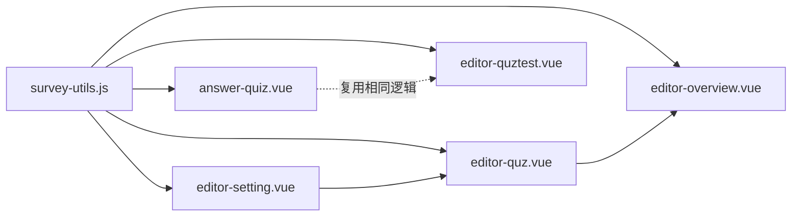

## 需求概述

### 1. 数据模型重构：维度挪到选项上

- **旧模式**：题目有 `dimensionIndex` 绑定单个维度，选项只有一个 `score`，累加到该维度
- **新模式**：题目删除 `dimensionIndex`，选项的 `score` 改为 `scores[]` 数组，数组元素为 `{ dIndex, value }`，一个选项可以同时给多个维度加减分

### 2. 维度拆分：4个合并维度 → 8个独立维度

- 旧 4 维度：`E/I 外向与内向`、`S/N 感觉与直觉`、`T/F 思考与情感`、`J/P 判断与感知`
- 新 8 维度：`外向性`、`内向性`、`感觉型`、`直觉型`、`思考型`、`情感型`、`判断型`、`感知型`

### 3. 匹配算法：范围匹配 → 纯最近邻（方案B）

- 结果类型存储：从 `ranges: [{min, max}]` 改为 `prototypes: [数值数组]`（每个维度一个原型值 0-100）
- 匹配逻辑：计算用户归一化得分向量与每个结果类型原型向量的欧几里得距离，取距离最小的作为匹配结果，同时计算置信度
- 旧的 `detectCoverageGaps` 适配新算法（检查各维度的原型值是否已填写而非检查范围空隙）

### 4. 编辑器 UI 变更

- `editor-setting.vue`：结果类型展开区的维度判定从 {min, max} 双输入框改为单值原型输入框
- `editor-quz.vue`：题目头部删除维度选择器，选项的分数改为弹出面板编辑 scores[]

### 5. 算法文档

- 新增 `common/survey-algorithm.md`，说明新旧两种算法的原理、数据结构定义、切换/回退方式

### 6. 涉及页面

- `common/survey-utils.js`（算法核心）、`common/survey-algorithm.md`（新文档）
- `pages-tools/editor-setting/editor-setting.vue`（维度/结果类型编辑）
- `pages-tools/editor-quz/editor-quz.vue`（题目编辑）
- `pages-tools/editor-overview/editor-overview.vue`（总览/保存/覆盖检测）
- `pages-tools/answer-quiz/answer-quiz.vue`（答题计分+结果匹配）
- `pages-tools/editor-quztest/editor-quztest.vue`（测试结果页）

## 技术方案

### 技术栈

- Vue2 + uni-app + uniCloud（微信小程序）
- 核心算法：纯 JavaScript 函数，位于 `common/survey-utils.js`

### 数据结构变更

```
// 旧 option
{ text: '选项A', score: 10 }

// 新 option
{ text: '选项A', scores: [{ dIndex: 0, value: 8 }, { dIndex: 3, value: -2 }] }

// 旧 resultType.ranges
[{ min: 0, max: 100 }, { min: 20, max: 80 }, ...]

// 新 resultType.prototypes
[75, 25, 85, 15, 60, 40, 80, 20]  // 每个维度一个原型值

// 旧 question
{ dimensionIndex: 0, title: '...', options: [...] }

// 新 question
{ title: '...', options: [...] }  // 删除 dimensionIndex
```

### 兼容策略

- `doSave()` 保存到云函数时，`dimensionIndex` 字段标记为 `0`（向后兼容 schema 字段要求）
- 新老数据通过 `prototypes` vs `ranges` 字段名区分

### 最近邻匹配算法说明

```
输入：用户归一化得分向量 S = {d0: s0, d1: s1, ..., dn: sn}
      结果类型原型向量 P = {type0: [p0, p1, ..., pn], type1: [...]}

对每个结果类型 t：
  距离 d_t = sqrt( sum( (s_i - p_ti)^2 for i in 0..n ) )
  置信度 conf_t = max(0, 1 - d_t / 200)   // 归一化到 0-1

匹配结果 = argmin(d_t)  // 距离最小的结果类型
```

## 执行架构



## 目录结构

```
common/
├── survey-utils.js       # [MODIFY] 算法核心：重写normalizeDimensionScores、新增nearestNeighborMatch、更新detectCoverageGaps
└── survey-algorithm.md   # [NEW] 算法说明文档（新旧对比+切换方式）

pages-tools/
├── editor-setting/
│   └── editor-setting.vue    # [MODIFY] 8维度+结果类型原型输入+覆盖检测适配
├── editor-quz/
│   └── editor-quz.vue        # [MODIFY] 删除dimensionIndex+选项分数的弹出面板
├── editor-overview/
│   └── editor-overview.vue   # [MODIFY] 覆盖检测适配+原型预览+保存逻辑适配
├── answer-quiz/
│   └── answer-quiz.vue       # [MODIFY] 计分逻辑适配+matchedType改用最近邻
└── editor-quztest/
    └── editor-quztest.vue    # [MODIFY] 同上（复用answer-quiz逻辑）
```

## Agent Extensions

本计划暂未用到任何 Agent Extensions。所有修改均为纯 JavaScript/Vue 代码变更，不涉及浏览器自动化、文档生成或多模态内容。