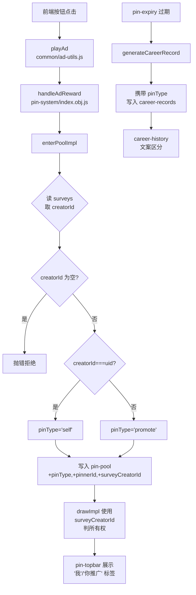

## 需求概述

基于设计文档实现问卷置顶系统二期"助力功能"，核心改动包括：

1. **问卷身份体系**：通过 surveys 集合的 `creatorId` 字段区分官方问卷(null)、自己的问卷(creatorId===uid)、他人的问卷(creatorId!==uid)
2. **禁止官方问卷置顶**：前端隐藏置顶入口按钮 + 后端 enterPoolImpl 拦截，双层防护
3. **助力推广**：用户置顶他人问卷时，数据库记录 `pinType='promote'`、`pinnerId` 记录推广者身份
4. **surveyAuthor 修复**：助力场景下置顶栏卡片取问卷真实创建者昵称，而非推广者昵称
5. **叙事层文案区分**：按钮文案("看广告置顶"/"助力推广"/不显示)、候场区提示文案("你的问卷"/"你推广的问卷")、战绩单文案("置顶战绩"/"推广战绩")、置顶栏卡片标签("你推广的")
6. **旧数据兼容**：无 `pinType/pinnerId` 的旧 doc 按 `'self'` 处理
7. **权重适配**：所有权重判定从 `userId`(推手) 改为 `creatorId`(问卷创作者)，原 doc §4.3 声称"无需修改"但实际上需要修改，否则推广场景下权重归属错误

## 技术方案

### 技术栈

- Vue2 + uni-app + uniCloud（微信小程序）
- 云对象：`pin-system/index.obj.js`（1533行核心逻辑）
- 定时云函数：`pin-expiry/index.js`（720行过期处理）
- 数据库：`pin-pool`、`career-records`、`survey-queue` 集合
- 前端：`result.vue`、`my-surveys.vue`、`career-history.vue`、`pin-topbar.vue`
- 广告工具：`common/ad-utils.js`

### 实现策略

**关键设计决策**：`pinType` 不由前端传递（不安全），而是后端在 `enterPoolImpl` 中通过对比 `survey.creatorId` 与当前 `uid` 自动确定。

**`userId` 字段语义变更**：现有代码中 `pin-pool.userId` 被用作"拥有者"判定（权重/isMine）。二期改为 `surveyCreatorId` 承载问卷创作者身份，`userId` 保持在入池操作者的语义不变，权重/展示判定切换为 `surveyCreatorId`。

**backend 三处入池点统一改造**：

- `enterPoolImpl`（主线入口）
- `queueToPoolImpl`（主动候场转置顶）
- `inlineQueueToPool`（超时自动转置顶）

### 架构图



### 详细实现说明

#### 1. Schema 改动

**pin-pool.schema.json** +3 字段：

- `pinType` (String): `"self"` 或 `"promote"`，无值视作 `"self"` 兼容旧数据
- `pinnerId` (String): 实际执行入池操作的用户ID
- `surveyCreatorId` (String): 问卷原始创建者ID，用于权重归属判定

**career-records.schema.json** +1 字段：

- `pinType` (String): 同上

#### 2. 后端核心逻辑

**enterPoolImpl**（index.obj.js line 182-328）：

- 读取 survey 时额外提取 `creatorId`（line 250-255 处已有 survey 查询，扩展即可）
- 新增官方问卷拦截：`if (!creatorId) throw Error('官方问卷不可置顶')`
- 确定 pinType：`const pinType = creatorId === uid ? 'self' : 'promote'`
- 修复 surveyAuthor：promote 时反查 creator 的 nickname
- 写入 pin-pool 时增加 `pinType, pinnerId: uid, surveyCreatorId: creatorId`

**queueToPoolImpl**（line 334-431）+ **inlineQueueToPool**（pin-expiry line 621-685）：

- 同样在读取 survey 信息处获取 `creatorId`
- 加入相同的逻辑链（判定→修复→写入新字段）

**calculateWeightImpl**（line 153-176）+ **drawImpl**（line 461-548）：

- 所有权判定从 `pinDoc.userId === currentUserId` 改为 `pinDoc.surveyCreatorId === currentUserId`
- `isMine` 判定同步修改
- draw 返回中加入 `pinType` 和 `pinnerId` 字段供前端使用

**generateCareerRecord**（pin-expiry line 449-467）：

- 写入 career-records 时携带 `pinType: pinDoc.pinType || 'self'`

#### 3. 前端改动

**result.vue**：

- 加载 survey 时获取 `creatorId` 和当前用户 `uid`
- 根据 creatorId 值动态控制按钮显示及文案：
- `!creatorId` → 完全隐藏按钮
- `creatorId === uid` → "看广告置顶"
- `creatorId !== uid` → "助力推广"

**my-surveys.vue**：

- 调查每个 item 是否有 `creatorId`（无则隐藏按钮）
- 按钮文案改为"看广告置顶"（因列表均为自己的问卷）
- 添加条件渲染防止官方问卷显示

**career-history.vue**：

- 槽位管理台标题/描述文案根据 `pinType` 区分
- 历史档案列表中根据 `pinType` 显示"置顶战绩"或"推广战绩"

**pin-topbar.vue**：

- 增加"你推广的"标签：`pinnerId === currentUserId && pinType === 'promote'`
- 与现有"我"徽章（基于 `surveyCreatorId === uid`）互斥

### 性能与兼容性

- **旧数据兼容**：无 `pinType` 的 doc 在 `calculateWeightImpl` 中通过 `pinDoc.surveyCreatorId || pinDoc.userId` 降级，保持逻辑正确
- **无迁移成本**：旧 pin-pool 数据无新字段，代码中按 undefined 安全处理
- **无额外查询**：survey 信息已在入池时查询，复用同一结果获取 creatorId，无额外 DB 开销

### 目录结构

```
c:\Users\hange\Documents\HBuilderProjects\快乐大狐狸工具集 - 副本\
├── uniCloud-alipay/
│   ├── database/
│   │   ├── pin-pool.schema.json              # [MODIFY] + pinType/pinnerId/surveyCreatorId
│   │   └── career-records.schema.json         # [MODIFY] + pinType
│   └── cloudfunctions/
│       ├── pin-system/
│       │   └── index.obj.js                   # [MODIFY] enterPoolImpl/queueToPoolImpl/calculateWeightImpl/drawImpl
│       └── pin-expiry/
│           └── index.js                       # [MODIFY] inlineQueueToPool + generateCareerRecord
├── common/
│   └── ad-utils.js                            # [MODIFY] callHandleAdReward 返回结果携带 pinType（可选）
├── pages-tools/
│   ├── result/
│   │   └── result.vue                         # [MODIFY] 按钮文案/条件/creatorId加载
│   └── career/
│       └── career-history.vue                 # [MODIFY] 文案区分
├── pages-tools/
│   └── my-surveys/
│       └── my-surveys.vue                     # [MODIFY] 按钮文案/条件
└── components/
    └── pin-topbar/
        └── pin-topbar.vue                     # [MODIFY] 新增"你推广的"标签
```

## Agent Extensions

### SubAgent

- **code-explorer**
- Purpose: 在前期探索阶段用于快速扫描多个文件的代码结构和关键定位点
- Expected outcome: 确认所有需要修改的文件路径、行号范围、现有代码模式

### Integration

- **cloudStudio**
- Purpose: 开发完成后部署到 Cloud Studio 进行在线验证
- Expected outcome: 功能在云环境部署成功，可进行真机测试