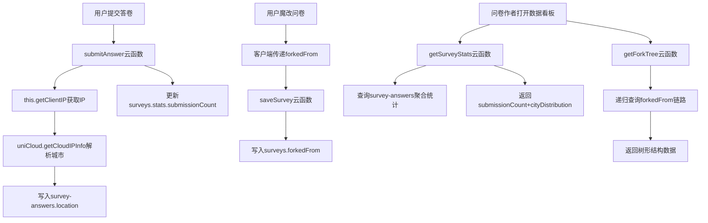

## 产品概述

基于现有的问卷系统（已支持创建、编辑、作答、魔改），扩展**问卷数据追踪**与**Fork谱系**功能，让问卷作者能查看自己问卷的传播数据和衍生脉络。

## 核心功能

1. **作答数据看板**：展示每份问卷的累计作答人数、城市答题者分布（通过IP解析到城市级别）
2. **Fork谱系图**：以树状图展示问卷的魔改（fork）衍生脉络，清晰展示某问卷被哪些用户魔改出了哪些衍生版本

## 功能逻辑

- 数据采集层：提交答卷时自动记录IP来源城市；魔改复制问卷时自动标记父问卷ID（`forkedFrom`）
- 数据查询层：云函数提供 `getSurveyStats`（作答统计+城市分布）和 `getForkTree`（递归查询谱系树）
- 数据展示层：新页面 `survey-stats` 整合统计概览 + 城市排行 + Canvas绘制的谱系树

## 技术方案

### Tech Stack Selection

- 沿用现有技术栈：Vue2 + uni-app + uniCloud（阿里云版）
- 数据库：沿用现有 surveys 和 survey-answers 集合，仅扩展字段
- 前端绘图：微信小程序 Canvas API（谱系图使用 canvas 2D context 绘制树状图）
- IP解析：uniCloud 内置 `this.getClientIP()` + `uniCloud.getCloudIPInfo()` 解析城市，无需第三方API

### Implementation Approach

#### 整体策略

在现有数据模型基础上扩展字段，保持向后兼容。数据采集在云函数层面完成（submitAnswer加入IP解析、saveSurvey加入forkedFrom），前端负责传递上下文参数和展示。

#### 关键设计决策

1. **城市数据不存原始IP**：只存解析后的城市字符串（如"广东省深圳市"），符合隐私合规要求，且存储成本极低。

2. **answerCount复用现有机制**：`submitAnswer` 已经自动维护 `stats.submissionCount`，无需额外修改。城市分布通过对 `survey-answers` 按 `surveyId` 过滤 + `location` 分组聚合查询获得。

3. **Fork谱系树结构**：采用单向链表式设计（每份问卷只存 `forkedFrom` 指向父问卷ID），查询时通过递归向上/向下遍历构建树形结构。树深度设上限50层，实际场景一般不超过10层，uniCloud的查询配额完全够用。

4. **Canvas绘图**：谱系图使用微信小程序 Canvas API（2D context）绘制，纯代码实现节点（圆角矩形+文本）+ 连线（贝塞尔曲线），无需第三方库依赖。

5. **Fork链路完整性**：所有魔改入口（历史问卷页点击卡片、答题结果页"魔改"按钮）都需要记录 `forkedFrom`。由于编辑器流程复杂（editor-setting → editor-quz → editor-overview），通过Storage链式传递 `forkedFrom` 参数。

#### 各魔改入口的 forkedFrom 传递路径

| 入口 | 流程 | forkedFrom 传递方式 |
| --- | --- | --- |
| history-survey 点击卡片 | getSurveyDetail → saveSurvey | 直接在 saveSurvey 参数中传入 `forkedFrom: item.surveyId` |
| answer-quiz 结果页"魔改" | 存storage → editor-setting → editor-quz → editor-overview | 通过storage链式传递 `forkedFrom: this.surveyId` |


### Implementation Notes

#### 数据模型变动

- `surveys` 集合：新增 `forkedFrom` 字段（string | null），记录从哪份问卷魔改而来
- `survey-answers` 集合：新增 `location` 字段（string，如"广东省深圳市"）

#### 性能考量

- `getSurveyStats`：按 surveyId 过滤，surveyId_createdAt 复合索引可覆盖
- `getForkTree`：递归查询，每次查询一个节点。设 maxDepth=50 防止死循环
- 谱系图初次加载时请求一次，数据缓存在组件内，切页后重新加载

#### 云端调试提醒

- 每次修改云函数后，在 HBuilderX 中右键云函数目录 → **上传部署**
- `uniCloud.getCloudIPInfo()` 需要在云函数运行环境中生效，本地调试可能返回空值

### Architecture Design

#### 数据流



#### 页面结构

```mermaid
flowchart LR
    A[workbench\n问卷卡片] -->|点击\"数据\"按钮| B[survey-stats\n数据看板页]
    B --> C[统计概览卡片区]
    B --> D[城市分布排行区]
    B --> E[Fork谱系图区\nCanvas绘制树状图]
```

### Directory Structure

```
project-root/
├── uniCloud-alipay/
│   ├── cloudfunctions/
│   │   └── tools/
│   │       └── index.obj.js  # [MODIFY] submitAnswer加入IP解析; saveSurvey支持forkedFrom; 新增getSurveyStats、getForkTree方法
│   └── database/
│       ├── surveys.schema.json         # [MODIFY] 新增 forkedFrom 字段定义
│       └── survey-answers.schema.json  # [MODIFY] 新增 location 字段定义
├── pages-tools/
│   ├── editor-overview/
│   │   └── editor-overview.vue  # [MODIFY] doSave和ensureSurveySaved方法从storage读取forkedFrom并传递给saveSurvey; 底部新增"数据看板"按钮
│   ├── history-survey/
│   │   └── history-survey.vue    # [MODIFY] forkSurvey方法中给saveSurvey传递forkedFrom: item.surveyId
│   ├── answer-quiz/
│   │   └── answer-quiz.vue       # [MODIFY] forkSurvey方法将当前surveyId作为forkedFrom存入storage
│   ├── editor-setting/
│   │   └── editor-setting.vue    # [MODIFY] 从storage读取forkedFrom并传递到editor-quz的storage数据中
│   ├── editor-quz/
│   │   └── editor-quz.vue        # [MODIFY] 存储editor_overview_data时保留forkedFrom
│   ├── workbench/
│   │   └── workbench.vue         # [MODIFY] 问卷卡片上新增"数据"按钮，点击跳转survey-stats?id=xxx
│   └── survey-stats/
│       └── survey-stats.vue      # [NEW] 数据看板页面：统计概览卡片 + 城市分布排行 + Canvas Fork谱系图
├── common/
│   └── survey-utils.js           # [MODIFY] 可选：新增谱系图布局计算工具函数
└── pages.json                    # [MODIFY] 注册 survey-stats/survey-stats 页面路由
```

### Key Code Structures

#### getSurveyStats 云函数方法签名

```javascript
/**
 * 获取问卷统计数据
 * @param {Object} params
 * @param {string} params.surveyId - 问卷ID
 * @returns {Object} { errCode, data: { submissionCount, avgDuration, cityDistribution: [{ city, count }], totalForkCount } }
 */
```

#### getForkTree 云函数方法签名

```javascript
/**
 * 获取问卷的Fork谱系树（包含向上父辈和向下所有子代）
 * @param {Object} params
 * @param {string} params.surveyId - 起始问卷ID
 * @param {number} [params.maxDepth=50] - 最大递归深度
 * @returns {Object} { errCode, data: { root: { id, title, creatorId, answerCount, children: [...] } } }
 */
```

#### Fork谱系树节点数据结构

```javascript
// 树节点
{
  surveyId: "xxx",
  title: "问卷标题",
  creatorId: "用户ID",
  answerCount: 42,
  children: [
    { surveyId: "...", title: "...", creatorId: "...", answerCount: 10, children: [] },
    // ...
  ]
}
```

## 设计风格

采用与现有问卷工具一致的简洁专业风格，确保新页面与已有的 workbench、editor-overview 等页面视觉统一。

## 数据看板页（survey-stats）设计

### 页面布局（从上到下，共5个区块）

#### 区块1：顶部导航

- 左侧返回箭头 + "数据看板" 标题文字
- 背景色使用 app 默认导航栏（与现有页面一致）

#### 区块2：基础统计卡片区（2x2网格）

- 卡片1（作答人数）：大号数字（36px粗体），下方"累计作答"描述
- 卡片2（平均时长）：大号数字+"秒"，下方"平均作答时长"描述
- 卡片3（衍生数量）：大号数字，下方"衍生问卷数量"描述
- 卡片4（魔改来源）：显示"原创"标签（如为根问卷）或"来自：[父问卷标题]"（如为衍生问卷）
- 每张卡片为白色圆角矩形（12px圆角），带轻微阴影

#### 区块3：城市分布排行区

- 标题"答题者地区分布" + 人数总数
- 列表形式：每行显示城市名 + 进度条（按人数比例，渐变色） + 人数数字
- 按人数从高到低排序，最多显示TOP15
- 进度条颜色使用主色调蓝色渐变，体现数据感

#### 区块4：Fork谱系图区

- 标题"Fork谱系图" + 问卷总数
- 使用 Canvas 绘制垂直树状图
- 每个节点为圆角矩形，显示截断的问卷标题（最多8字）和创建者ID末4位
- 当前问卷节点使用高亮样式（蓝色边框 + 蓝色背景）
- 父节点在上，子节点在下，用贝塞尔曲线连接
- 支持上下滑动查看完整树（scroll-view 包裹）
- 空状态：无衍生时显示"暂无魔改记录"

#### 区块5：底部留白

- 30px 安全区域

# Agent Extensions

此计划无需使用任何扩展。所有功能均基于现有技术栈（Vue2 + uni-app + uniCloud）实现，不引入外部API、图片或第三方库。