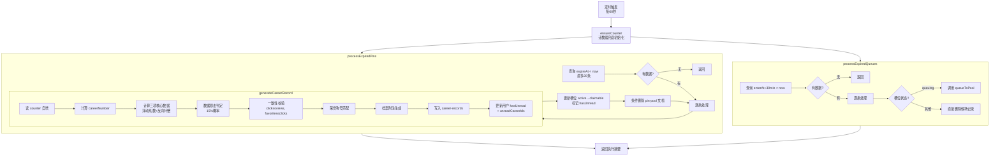

## 阶段三：定时云函数过期清理 + 内联战绩单生成

### 当前状态

阶段零A（数据库Schema）、阶段零B（云对象骨架+资历）、阶段零C（前端骨架）、阶段一（入池核心）、阶段二（权重+抽取）均已全部完成。pin-system云对象已实现完整的 enterPool、queueToPool、draw、四层权重算法等核心逻辑。

### 阶段三目标

实现 `pin-expiry` 定时云函数，由定时触发器每分钟自动执行以下任务：

1. **过期置顶问卷清理**：查询 `pin-pool` 中 `expireAt < now` 的过期文档，逐条处理
2. **战绩单档案生成（内联）**：为每条过期问卷计算三项核心数据（驻足注视/好奇打开/决定存档），匹配荣誉称号和档案附注，写入 `career-records` 集合
3. **槽位状态更新**：将用户对应槽位从 `active` 更新为 `claimable`，标记 `hasUnread = true`
4. **置顶池文档删除**：条件删除已处理的过期文档
5. **候场区兜底清理**：检测 `survey-queue` 中超时记录（enterAt + 30分钟），自动调用 queueToPool 或直接删除
6. **幂等与异常兜底**：条件删除防止重复处理，每条文档独立 try-catch，最多处理 20 条/次，连续失败 3 次上报日志

### 核心设计约束

- `generateCareer` 逻辑内联在 `pin-expiry` 中实现，不通过跨云函数调用 `pin-system`，避免两层冷启动
- 配置参数当前硬编码（与 pin-system 保持一致的 PIN_CONFIG 常量），后续统一迁移至 uni-config-center
- 计数器 `careerArchiveSeq` 在首次运行时自动初始化兜底

## 技术方案

### 技术栈

- **运行时**：uniCloud 支付宝云 云函数（Node.js）
- **数据库**：uniCloud MongoDB（云数据库）
- **触发器**：定时触发器（config.json 配置 cron 表达式 `0 */1 * * * * *` 每分钟执行）
- **配置**：当前硬编码 PIN_CONFIG，pin-expiry/package.json 已声明 uni-config-center 依赖预留迁移

### 实现方案

#### 架构设计

`pin-expiry` 作为独立定时云函数，不依赖 `pin-system` 云对象。其内部架构分为三层：



#### 目录结构

```
uniCloud-alipay/cloudfunctions/pin-expiry/
├── index.js       [REWRITE] 从 17 行骨架重写为完整实现（约 350-400 行）
├── package.json   [MODIFY] 已有 uni-config-center 依赖，状态正确
└── config.json    [NEW] 定时触发器配置（每分钟执行）
```

#### 关键代码设计

**1. generateCareerRecord 数据生成算法**

核心逻辑严格遵循设计文档 §7.2.2 和 §7.2.3：

- **驻足注视（views）**：
- 基础值 = simulatedActiveUsers × pinDoc.weight / 全池总权重
- 浮动系数：randomBetween(viewFloatMin, viewFloatMax)，资历越浅取上限概率越高
- 零头修饰：±random(0~50) 随机偏移，结果有零有整

- **好奇打开（clicks）**：
- clickRate = randomBetween(clickRateMin, clickRateMax)
- 反向补偿：资深历用户 clickRate 上下限同时下移
- clicks = Math.round(views × clickRate)

- **决定存档（favorites）**：
- favRate = randomBetween(favoriteRateMin, favoriteRateMax)
- favorites = Math.max(favoriteFloor, Math.round(clicks × favRate))

- **数据暴击**：
- 触发：Math.random() < bonusTriggerRate
- 随机选择 views 或 clicks 维度，乘以 randomBetween(bonusMultiplierMin, bonusMultiplierMax)

- **一致性校验**：clicks ≤ views && favorites ≤ clicks && 全部为正整数，否则向下修正异常值

- **荣誉称号匹配**（MVP 版本 10 个荣誉称号的预置池）：
- 基于 views/clicks/favorites 的相对比值映射
- 含：人群中的灯塔、万众瞩目者、档案馆宠儿、冷门黑马、含梗量宗师 等
- 暴击触发时匹配专属暴击称号
- careerNumber === 1 时附加"首秀认证"标识

- **档案附注**（预置 15-20 条语料）：
- 按场景分类（驻足型、点开型、存档型、暴击型、时段型、新手型）
- 随机抽取 + 变量插入（时间段、数值）
- 末尾统一附免责声明

**2. 幂等性设计**

- 删除操作使用条件删除：`deleteOne({ _id: docId, expireAt: { $lt: now } })`，保证不会重复处理
- 每条文档处理使用独立 try-catch，单文档异常不影响批次内其他文档
- 连续失败 3 次的文档记录错误日志，保留 expireAt 等待人工排查
- 槽位状态更新使用 `update` 而非条件更新（幂等写入同一状态无副作用）

**3. 计数器兜底**

处理第一条过期文档前，检查 `counter` 集合中是否存在 `_id: 'careerArchiveSeq'` 的记录：

- 存在 → 正常读值 → increment
- 不存在 → 初始化 `{ _id: 'careerArchiveSeq', seq: 0 }` → increment

#### 执行注意事项

- **冷启动**：定时云函数首次调用有约 1-2 秒冷启动延迟，定时触发可接受，不影响业务
- **超时兜底**：每次最多处理 20 条过期文档，单文档约 3-4 次数据库写入，全部处理 ≤ 2 秒，远低于云函数 10 秒超时限制
- **日志**：复用 console.log 模式（与 pin-system 一致），输出处理摘要（处理条数、成功/失败数）
- **无过期文档**：立即返回零开销
- **候场区兜底**：处理候场超时记录时需读用户槽位确认当前状态，避免与正常流程冲突
- **配置硬编码**：当前在 pin-expiry/index.js 顶部复制 PIN_CONFIG.career + PIN_CONFIG.queue + PIN_CONFIG.pool 相关字段，添加注释 `// TODO: 迁移至 uni-config-center`

# Agent Extensions

本阶段为纯后端云函数开发，不需要使用 Agent Extensions。